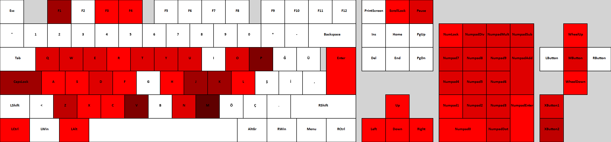

# AutoHotkey Layout Visualizer

Visualize your keybinds!

## Usage

`python main.py ISO105_tr-TR script.ahk out.svg`

## Information

[Layouts](/layouts/) are pulled from [here](https://raw.githubusercontent.com/ijprest/keyboard-layout-editor/refs/heads/master/layouts.json).

References [AutoHotkey key list](https://www.autohotkey.com/docs/v1/KeyList.htm) from the docs. Scan codes (SCxxx) and virtual keys (VKxxx) are ignored.

(only [tr-TR](layouts/ISO105_tr-TR.json) is in the proper format, do a PR if you make one for yours).

For other keyboard globalizations you can look at [Microsoft's learn pages](https://learn.microsoft.com/en-us/globalization/windows-keyboard-layouts) regarding the topic.

## Known issues

- Files that require niche encodings might not work.
- `I` doesn't work `¯\_(ツ)_/¯`, it's a weird character in AutoHotkey as well

## Dependencies

[svg.py](https://github.com/orsinium-labs/svg.py), Licensed under MIT license.
